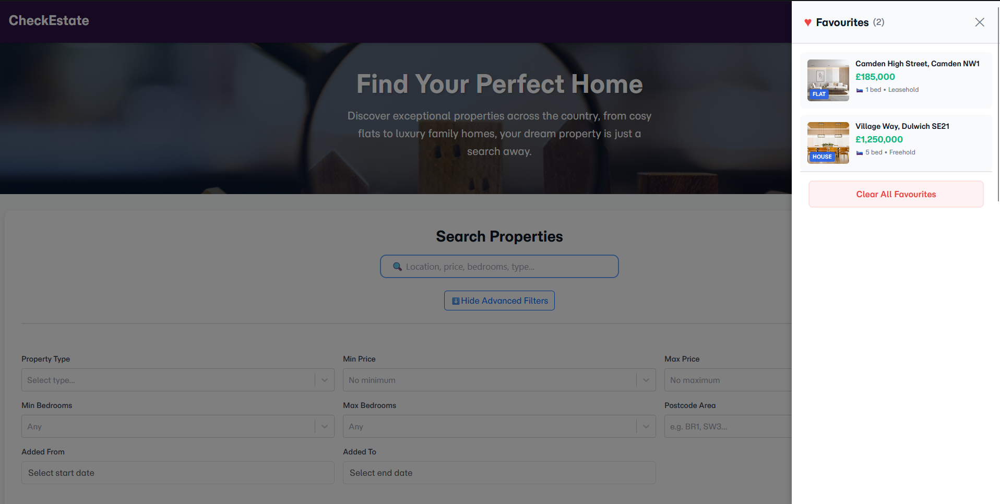

# 🏠 CheckEstate

> A modern, feature-rich React application for searching and filtering property listings across London.  Built with React 18, Vite, and Bootstrap with advanced features like drag-and-drop favourites, real-time search, and responsive design.

[](https://Dilagante.github.io/CheckEstate/)
[](https://reactjs.org/)
[](https://vitejs.dev/)
[](#)

**🌐 Live Demo:** [https://Dilagante.github.io/CheckEstate/](https://Dilagante.github.io/CheckEstate/)

---

## 📸 Screenshots

### Homepage with Search


### Property Details


### Favourites Sidebar


---

## ✨ Features

### 🔍 **Advanced Search & Filtering**
- **Quick Search** - Search across location, price, bedrooms, type, and more with a single input
- **Advanced Filters** - Collapsible filter panel with 8+ filter options
- **Real-time Results** - Filters apply automatically as you type/select
- **Active Filter Counter** - See how many filters are active at a glance
- **One-Click Reset** - Clear all filters instantly

### ❤️ **Smart Favourites System**
- **Click to Save** - Heart icon on each property card
- **Drag & Drop** - Drag property cards onto the floating favourites button
- **Persistent Storage** - Favourites saved in localStorage across sessions
- **Favourites Sidebar** - Slide-out panel with full property details
- **Animated Feedback** - Visual confirmation when adding/removing
- **First-Time Hints** - Animated tooltips guide new users
- **Batch Management** - Clear all favourites at once

### 🖼️ **Interactive Property Gallery**
- Multiple images per property
- Thumbnail navigation
- Previous/Next arrow controls
- Image counter (1 of 5)
- Smooth transitions
- Touch-enabled for mobile
- Responsive sizing

### 📑 **Property Details Tabs**
- **Description** - Full property details and key features
- **Floor Plan** - Interactive floor plan view
- **Location** - Embedded Google Maps with area information
### 📱 **Fully Responsive**
- Mobile-first design approach
- Breakpoints:  320px - 1920px
- Touch-optimized controls
- Adaptive layouts for all screen sizes
- Tested on iPhone, iPad, and desktop

---

## 🚀 Quick Start

### Prerequisites
- Node.js 18+ 
- npm 9+

### Installation

```bash
# Clone the repository
git clone https://github.com/Dilagante/CheckEstate.git

# Navigate to project directory
cd CheckEstate

# Install dependencies
npm install

# Start development server
npm run dev
```

Visit `http://localhost:5173` to view the app.

### Available Scripts

```bash
npm run dev          # Start development server with hot reload
npm run build        # Build for production
npm run preview      # Preview production build locally
npm run test         # Run tests with Vitest
npm run test:ui      # Run tests with interactive UI
npm run test:coverage # Generate test coverage report
npm run lint         # Lint code with ESLint
npm run deploy       # Deploy to GitHub Pages
```

## 🛠️ Technology Stack

### Core

- **React 18.3** - UI library
- **Vite 6.0** - Build tool and dev server
- **React Router 7.1** - Client-side routing

### UI Libraries

- **Bootstrap 5.3** - Base styling framework
- **React-Select 5.9** - Searchable dropdowns
- **React-DatePicker 7.5** - Date range selection
- **React-Tabs 6.0** - Tabbed content interface

### Development

- **Vitest** - Unit testing framework
- **React Testing Library** - Component testing
- **ESLint** - Code linting
- **PropTypes** - Runtime type checking

### Deployment

- **GitHub Pages** - Static site hosting
- **gh-pages** - Deployment automation
-
## 🧪 Testing

The application includes comprehensive unit tests covering:

- Component rendering
- Search and filter logic
- Favourites management
- Edge cases and empty states

### Run Tests

```bash
# Run all tests
npm test

# Run tests with UI
npm run test:ui

# Generate coverage report
npm run test:coverage
```

## 🌐 Deployment

The application is deployed on GitHub Pages using an automated workflow.

### Deploy to GitHub Pages

```bash
# Build and deploy in one command
npm run deploy
```

The site will be live at `https://yourusername.github.io/CheckEstate/` 

### Deployment Configuration

- **Base URL:** `/CheckEstate/` (configured in `vite.config.js`)
- **Router Basename:** `/CheckEstate` (configured in `App.jsx`)
- **Image URLs:** Handled by `getImageUrl()` helper
- **404 Handling:** Custom 404 page with SPA routing support

## 📱 Responsive Design

CheckEstate is fully responsive across all devices:

### Breakpoints

- **Mobile:** 320px - 767px (1 column layout)
- **Tablet:** 768px - 1023px (2 column layout)
- **Desktop:** 1024px+ (3 column layout)

### Mobile-First Approach

- Base styles optimized for mobile
- Progressive enhancement for larger screens
- Touch-friendly controls (min 44px)
- Simplified navigation on small screens

### Key Responsive Features

- Adaptive property grid (1/2/3 columns)
- Collapsible navigation menu
- Full-width favourites sidebar on mobile
- Responsive images with srcset
- Touch-enabled gallery navigation
- Adaptive typography scaling
## 📄 License

This project is licensed under the MIT License

---

## 👨‍💻 Author

**Dilagante**

- GitHub: [@Dilagante](https://github.com/Dilagante)
- Project: [CheckEstate](https://github.com/Dilagante/CheckEstate)

---

## 🙏 Acknowledgments

- Property data is fictional for demonstration purposes
- Images from Unsplash and property listing sites
- Built as coursework for Advanced Client-Side Development (5COSC026C)
- React and Vite communities for excellent documentation
- Bootstrap for responsive grid system
- React-Select, React-DatePicker, React-Tabs libraries
- Github Copilot for writing this Readme